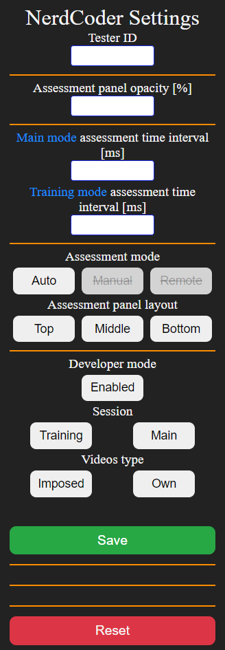

# NerdCoder-TUFIQoE-2021
Chrome extension (and more) for recording YouTube activity and gathering "nerd statistics" 
and video assessments

## Content
This repository contains the Chrome extension and tools that are necessary or optional for it 
to work properly.
- Flask REST API 
    - POST endpoint for captured data
    - GET endpoint to get data in form of JSON
- SQLite database
- NodeJS script for remote control of video assessment panel (optional)


## Installation
#### Chrome extension
The "dist" directory contains bundled files. Install the extension by loading
the "dist" directory with the "load unpacked" option.

#### REST API
1.  To set up Flask REST API one should download BACKEND directory.
2. Then setup python virtual environment  by using command
``` python -m venv [venv-name]```
3. Activate venv
    - on Windows ```[venv-name]\Scripts\activate```
    - on Linux ```source [venv-name]/bin/activate```
4. Set environment variable FLASK_APP=REST_API
    - on Windows: ```set FLASK_APP=REST_API```
   - on Linux: ```export FLASK_APP=REST_API```
5. Install required packages ```pip install -r requirements.txt```
6. While being in BACKEND directory execute command ```flask run```

####To reset database rows one can cd into BACKEND/database and execute ```python init.py```

## Extension popup - Settings
In the extension popup there are several fields that can be used to configure
the extension behaviour and some element's layout.





- ### [ N E W ] Tester ID
  - Enables to differentiate data captured from multiple testers
  - Number should be provided
  - If provided value is not a number - random sequence is generated (temporar solution)
  - [ I D E A ] Future idea is to manually provide tester's email address and generate
  hash value from it to store in database as tester's ID
- ### Assessment panel opacity [%]
  - Describes the level of invisibility of the assessment panel
  - Value is percentages
- ### Main Assessment time interval [ms]
  - Relevant only if [Session](#session) </a> is set to "main"
  - Describes how much time has to elapse before next assessment panel will show up
  - This field is only relevant when Assessment mode is set to Auto - see below
- ### Training mode assessment time
  - Same as above but relevant only if [Session](#session) is set to "training"
- ### Assessment mode
  - Auto - automatic assessment panel control. This mode is connected with "Assessment Time Inerval"
  - Manual - mostly for developing purposes, user can use "o" and "p" 
    keys to control the assessment panel within the same browser the extension is running on
  - Remote - very similar to Manual mode but nodeJS server script is necessary for it to work properly.
    User can control the assessment panel from the script running on the same or remote computer from the one that extension is running on
- ### Assessment panel layout
  - top, middle, bottom - defines the layout of the assessment panel
- ### Developer mode
  - Enables/disables the developer mode
  - If developer mode is enabled database connection is not checked, nerd statistics panel is visible, additional information
    panel is visible, captured data may not be saved
  - If developer mode is disabled (equals to production/experiment mode), database connection is checked every time user enters new video
  - In case connection fails (most likely reason for that is Flask REST API is not running)
    YouTube player is closed and warning screen is displayed with proper information.
  - ### It is advised to set developer mode to disabled during the real experiment.
- ###  <a name="session"> Session </a>
  - Define mode the extension is running. Training mode should have shorter assessment panel and network throttling intervals.
  Training mode uses "Training mode assessment time interval [ms]" and "training_scenario.json" configuration file.
  Main mode uses "Main mode assessment time interval [ms] and main_scenario.json" configuration file.

- ### Videos type
  - Gives information about stage of the experiment
  - own - tester is allowed to search and watch videos they like
  - imposed - testers must watch videos imposed by experiment operator, most likely in form of prepared YouTube playlist

# Throttling scheduling
In the dist directory there are "main_scenario.json" and "training_scenario.json" files. In extension's popup there is section where
we can choose what experiment mode are we running. Whether it is a main session or training. Training
session is shorter than main (shorter assessment and network throttling intervals).
Extension will use one of these two files to schedule network throttling.

In the "scenarios" subdirectory there is separate JSON file for each scenario. To use particular scenario
one should copy it contents (SINGLE SCENARIO OBJECT) to the "main_scenario.json" or "training_session.json" file which is imported by the
background script and used to schedule network throttling.


### After each change in scenarios.json one needs to reload the extension for the changes to take effect.

### Exemplary scenario file content
```
{
  "name": "Long scenario",
  "schedule":[
    {
      "timeout_s": 300,
      "params": {
        "offline": false,
        "latency": 1,
        "downloadThroughput": 1500000,
        "uploadThroughput": 1000000000
      }
    },
    {
      "timeout_s": 600,
      "params": {
        "offline": false,
        "latency": 1,
        "downloadThroughput": 1000000,
        "uploadThroughput": 1000000000
      }
    },
    {
      "timeout_s": 900,
      "params": {
        "offline": false,
        "latency": 1,
        "downloadThroughput": 700000,
        "uploadThroughput": 1000000000
      }
    },
    {
      "timeout_s": 1200,
      "params": {
        "offline": false,
        "latency": 1,
        "downloadThroughput": 300000,
        "uploadThroughput": 1000000000
      }
    }
  ]
}

```