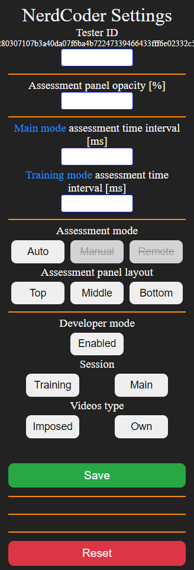

# NerdCoder-TUFIQoE-2021
Chrome extension (and more) for recording YouTube activity and gathering "nerd statistics" 
and video assessments

## Branches explained
v2 - version with ACR and Discord session - fixed and final should work fine <br>
v3 - work in progress, the goal is to provide two assessment panels:
  - one for assessing interest in displayed content
  - second for assessing quality of the audio-video
  
v4 - ACR only version of the software, there are 3 sessions, one training and two long ACR sessions. 

## Content
This repository contains the Chrome extension and tools that are necessary or optional for it 
to work properly.
- Flask REST API 
    - POST endpoint for captured data
    - GET endpoint to get data in form of JSON
- SQLite database
- NodeJS script for remote control of video assessment panel (optional)


## Installation
#### Chrome extension
The "dist" directory contains bundled files. Install the extension by loading
the "dist" directory with the "load unpacked" option.

#### REST API
1.  To set up Flask REST API one should download BACKEND directory.
2. Then setup python virtual environment  by using command
``` python -m venv [venv-name]```
3. Activate venv
    - on Windows ```[venv-name]\Scripts\activate```
    - on Linux ```source [venv-name]/bin/activate```
4. Set environment variable FLASK_APP=REST_API
    - on Windows: ```set FLASK_APP=REST_API```
   - on Linux: ```export FLASK_APP=REST_API```
5. Install required packages ```pip install -r requirements.txt```
6. While being in BACKEND directory execute command ```flask run```

####To reset database rows one can cd into BACKEND/database and execute ```python init.py```


## Extension popup - Settings
In the extension popup there are several fields that can be used to configure
the extension behaviour and some element's layout.



Tester ID
  - Used to differentiate data captured from multiple testers
- ### Assessment panel opacity [%]
  - Describes the level of invisibility of the assessment panel
  - Value is percentages
- ### Main Assessment time interval [ms]
  - Relevant only if [Session](#session) </a> is set to "main"
  - Describes how much time has to elapse before next assessment panel will show up
  - This field is only relevant when Assessment mode is set to Auto - see below
- ### Training mode assessment time
  - Same as above but relevant only if [Session](#session) is set to "training"
- ### Assessment mode
  - Auto - automatic assessment panel control. This mode is connected with "Assessment Time Inerval"
  - Manual - mostly for developing purposes, user can use "o" and "p" 
    keys to control the assessment panel within the same browser the extension is running on
  - Remote - very similar to Manual mode but nodeJS server script is necessary for it to work properly.
    User can control the assessment panel from the script running on the same or remote computer from the one that extension is running on
- ### Assessment panel layout
  - top, middle, bottom - defines the layout and positioning of the assessment panel
- ### Developer mode
  - Enables/disables the developer mode
  - If developer mode is enabled database connection is not checked, nerd statistics panel is visible, additional information
    panel is visible, captured data may not be saved
  - If developer mode is disabled (equals to production/experiment mode), database connection is checked every time user enters new video
  - In case connection fails (most likely reason for that is Flask REST API is not running)
    YouTube player is closed and warning screen is displayed with proper information.
  - ###  Developer mode must be <span style="color: red;"> disabled </span> during the real experiment.
  
- ###  <a name="session"> Session </a>
  - Define mode the extension is running. Based on that field extension will use different configuration files
    to schedule network throttling and end of session.

- ### Videos type
  - Gives information about stage of the experiment
  - own - tester is allowed to search and watch videos they like
  - imposed - testers must watch videos imposed by experiment operator, most likely in form of prepared YouTube playlist

- ### <a name="reset_button"> Reset button </a>
    - Resets assessment controller, chrome debugger and all scheduled tasks
    - Redirects to the session finish screen
    - After redirect extension is ready to start new session
    - <h3 style="color: red; margin:0">IT DOES NOT RELOAD THE EXTENSION</h3>
      <h4 style="margin:0">All settings configured in the popup and saved are not
               affected by this oper ation. To restore default settings (hardcoded in background script) one needs to reload the extension manually</h4>


# <a name="throttling_scheduling"> Throttling scheduling </a>
In the dist directory there is file named scenario_training.json that will be used to schedule throttling if 
extension is running in training session mode.<br>

In case of main session the scheduling configuration is generated dynamically by a script. <br>
No file is created and saved but information on the configuration is submitted to the database.<br>

Main scenario configuration schema is the same as training but it has less items in schedule property.


### Exemplary scenario file content
```
{
    "name": "scenario_main_013",
    "schedule": [
        {
            "type": "throttling",
            "timeout_s": 1,
            "params": {
                "offline": false,
                "latency": 1,
                "downloadThroughput": 768000,
                "uploadThroughput": 1000000000
            }
        },
        {
            "type": "throttling",
            "timeout_s": 300,
            "params": {
                "offline": false,
                "latency": 1,
                "downloadThroughput": 8192000,
                "uploadThroughput": 1000000000
            }
        },
        {
            "type": "throttling",
            "timeout_s": 600,
            "params": {
                "offline": false,
                "latency": 1,
                "downloadThroughput": 4096000,
                "uploadThroughput": 1000000000
            }
        },
        {
            "type": "throttling",
            "timeout_s": 900,
            "params": {
                "offline": false,
                "latency": 1,
                "downloadThroughput": 2048000,
                "uploadThroughput": 1000000000
            }
        },
        {
            "type": "throttling",
            "timeout_s": 1200,
            "params": {
                "offline": false,
                "latency": 1,
                "downloadThroughput": 512000,
                "uploadThroughput": 1000000000
            }
        },
        {
            "type": "throttling",
            "timeout_s": 1500,
            "params": {
                "offline": false,
                "latency": 1,
                "downloadThroughput": 16384000,
                "uploadThroughput": 1000000000
            }
        },
        {
            "type": "throttling",
            "timeout_s": 1800,
            "params": {
                "offline": false,
                "latency": 1,
                "downloadThroughput": 256000,
                "uploadThroughput": 1000000000
            }
        },
        {
            "type": "finish",
            "timeout_s": 2100
        }
    ]
}
```
# Session complete - view
Contains information what part of experiment has just ended. There is timer counting down to redirect to main YT page.
This view is brought up when RESET button in extension;s popup is activated popup or when session has ended.
<br>
After redirecting back to YouTube page the extension is ready to switch session or video types and start new session.


# YouTube Nerd Statistics glossary
Explanation of some key values returned by REST API.

- viewport - gives information about the current size of video player in pixels (video player resolution), examples: (take note that values below
  can depend on screen resolution or browser window size)
  - 1095x616 for default display,
  - 1179x663 for theater mode,
  - 1835x1032 for fullscreen mode

- total_frames - gives information how many video frames were loaded from webserver

- <span style="color: dodgerblue">current_resolution</span> - gives information on resolution of the video played which strongly depends on network condition

- <span style="color: dodgerblue">optimal_resolution </span> - gives information what resolution the video should have based on current viewport resolution
  (to maintain pixel density on proper level ?????), examples:
  - 640x360 in mini-player mode,
  - 1280x720 in default mode,
  - 1280x720 in theater mode,
  - 1920x1080 in fullscreen mode

- mystery_t - gives information on current time in the video

- mystery_s - is the value extracted from YouTube's mystery text, it gives information on state of the video,
  YouTube gives no official information about the mystery text meaning thus some of the 
  descriptions can be wrong
  - <span style="color: #ffc107">4 - video paused (certain) </span>
  - <span style="color: #ffc107">8 - video is playing (certain) </span>
  - <span style="color: #ffc107"> 9 - video buffering during playback (certain) </span>
  - 19 - buffering, most likely after seeking to part of timeline not included in buffer
  - <span style="color: #ffc107">24 - seeking video, changing current timeline position (certain) </span>
  - 35 - seeking while video was still buffering
  - 40 - loading the video, appears after video change
  - 49 - first buffering of the video, appears in the beginning after code 40
  - <span style="color: #ffc107"> e - video has ended (certain) </span>
